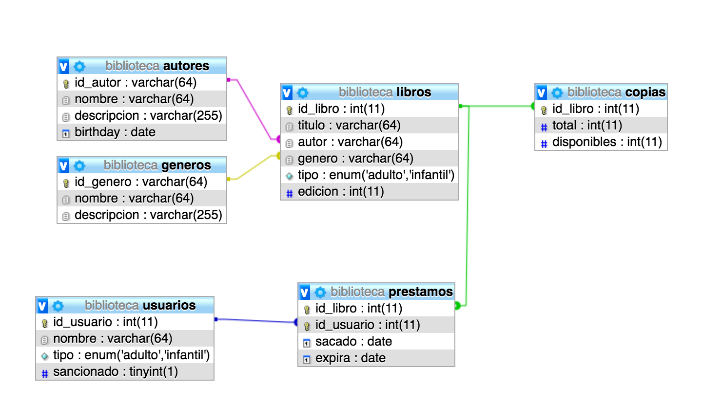
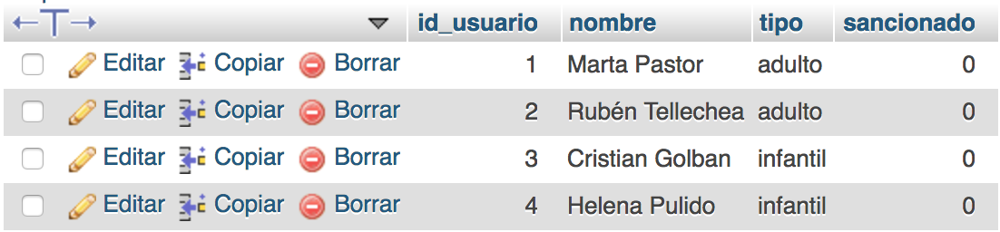
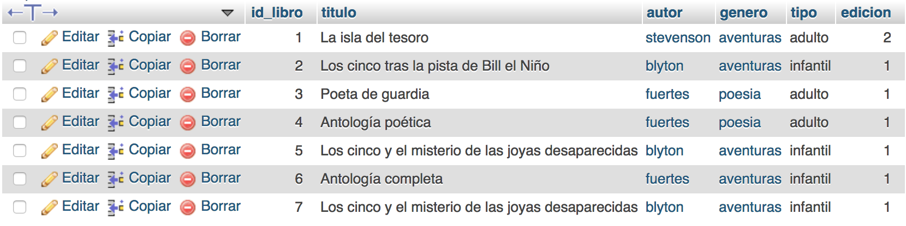

# AMPLIACIÓN DE BASES DE DATOS #

## Diseño avanzado de bases de datos relacionales

### PRÁCTICAS 1 Y 2

Crea la base de datos biblioteca y determina las tablas más adecuadas para representar la información.

```sql
CREATE TABLE `libros` (
  `id_libro` int(11) NOT NULL,
  `titulo` varchar(64) NOT NULL,
  `autor` varchar(64) NOT NULL,
  `genero` varchar(64) NOT NULL,
  `tipo` enum('adulto','infantil') NOT NULL,
  `edicion` int(11) NOT NULL DEFAULT '1'
);


CREATE TABLE `usuarios` (
  `id_usuario` int(11) NOT NULL,
  `nombre` varchar(64) NOT NULL,
  `tipo` enum('adulto','infantil') NOT NULL,
  `sancionado` tinyint(1) NOT NULL DEFAULT '0'
);


CREATE TABLE `prestamos` (
  `id_libro` int(11) NOT NULL,
  `id_usuario` int(11) NOT NULL,
  `sacado` date NOT NULL,
  `expira` date NOT NULL
);


CREATE TABLE `copias` (
  `id_libro` int(11) NOT NULL,
  `total` int(11) NOT NULL DEFAULT '1',
  `disponibles` int(11) NOT NULL DEFAULT '1'
);


CREATE TABLE `autores` (
  `id_autor` varchar(64) NOT NULL,
  `nombre` varchar(64) NOT NULL,
  `descripcion` varchar(255) DEFAULT NULL,
  `birthday` date NOT NULL
);


CREATE TABLE `generos` (
  `id_genero` varchar(64) NOT NULL,
  `nombre` varchar(64) NOT NULL,
  `descripcion` varchar(255) DEFAULT NULL
);
```


A través de la pestaña SQL, inserta, lee, borra datos, etc. Realiza lo mismo de una manera gráfica.

Primero, creamos unos pocos usuarios de prueba:
```sql
INSERT INTO `usuarios`(`nombre`, `tipo`, `sancionado`)
VALUES ("Marta Pastor", "adulto", false);
```



Ahora añadimos unos pocos libros al católogo, con su respectiva información de copias al respecto. Para ello, y debido a las dependencias entre las tablas, debemos crear primero la entrada correspiente al autor de la novela en la tabla `autores` y al género en la tabla `generos` y a continuación podemos añadir el libro:

```sql
INSERT INTO `autores`(`id_autor`, `nombre`, `birthday`)
VALUES ("stevenson", "R. L. Stevenson", "1800-01-01");

INSERT INTO `generos`(`id_genero`, `nombre`)
VALUES ("aventuras", "Aventuras");

INSERT INTO `libros`(`titulo`, `autor`, `genero`, `tipo`, `edicion`)
VALUES ("La isla del tesoro", "stevenson", "aventuras", "adulto", 2);

INSERT INTO `copias`(`id_libro`, `total`, `disponibles`)
VALUES (1, 6, 6);
```


